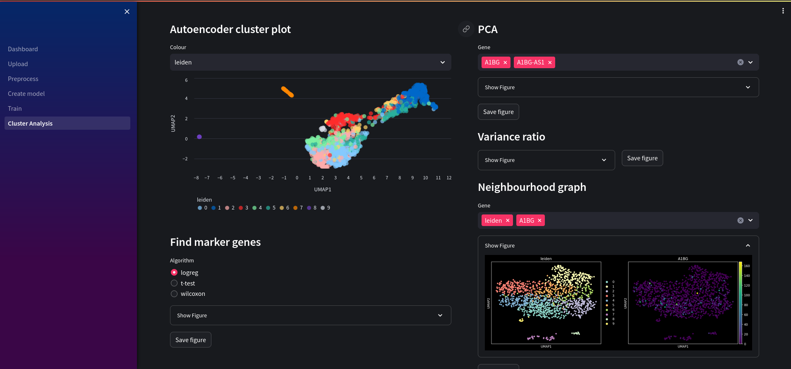

# Nuwa 🧬🐍
A Bioinformatics tool for data processing and analysis

### \*\*Work in progress!\*\*

## Getting Started

First, clone the repo:
```bash
git clone https://github.com/ch1ru/Nuwa.git && cd Nuwa
```

The easiest way to get started is using docker compose:
```bash
docker-compose up -d --build
```

Alternatively, you can run streamlit directly:
```bash
cd streamlit && streamlit run Dashboard.py --server.maxUploadSize 100000
```

Then visit http://localhost in your browser.

## Preprocess

Filter genes and cell metrics, find mitochrondrial and ribosomal genes, look at variability in gene expression.


## Build model

Build an deep autoencoder based on [Cite-seq model](https://github.com/naity/citeseq_autoencoder) for cluster analysis.


## Analysis

Currently analysis consists of:
- Autoencoder cluster plot
- Principal Component Analysis of selected genes
- Variance ratio of principal components
- Neighbourhood graph



## Future work

- Integrate postgresql database for persistent record keeping
- Add logging, make visible on ui
- Add other autoencoder models
- support other files types
- Add other analysis scores/graphs