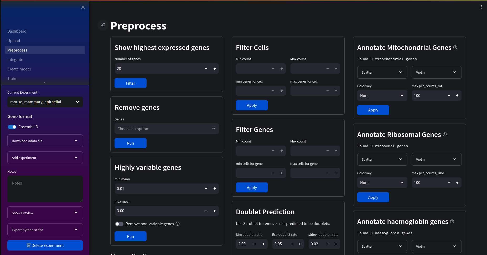
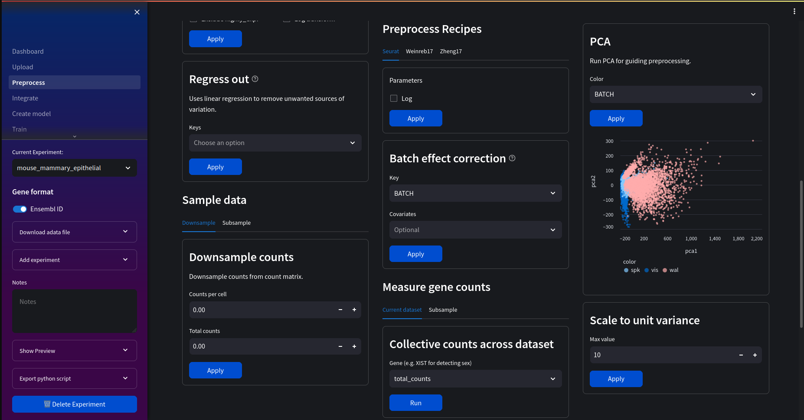
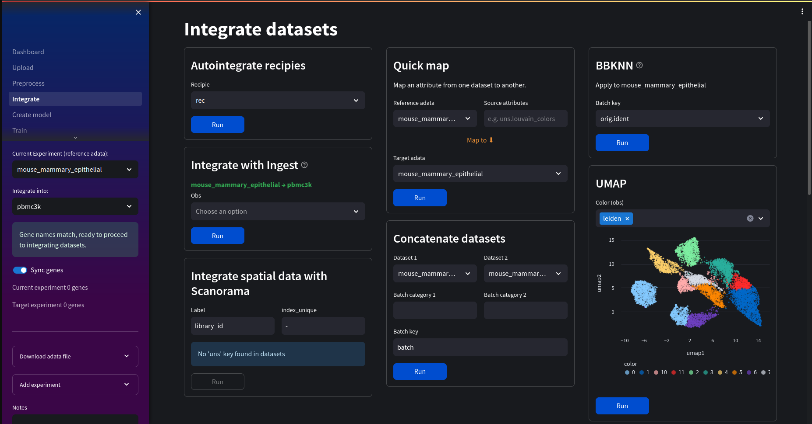
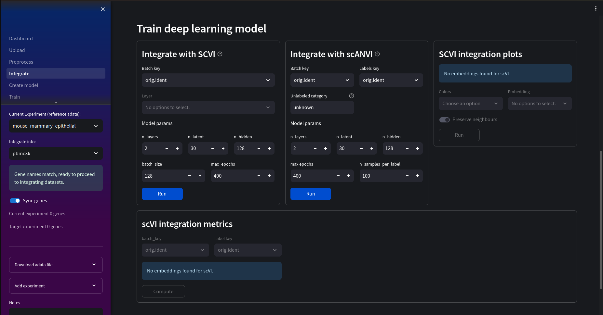
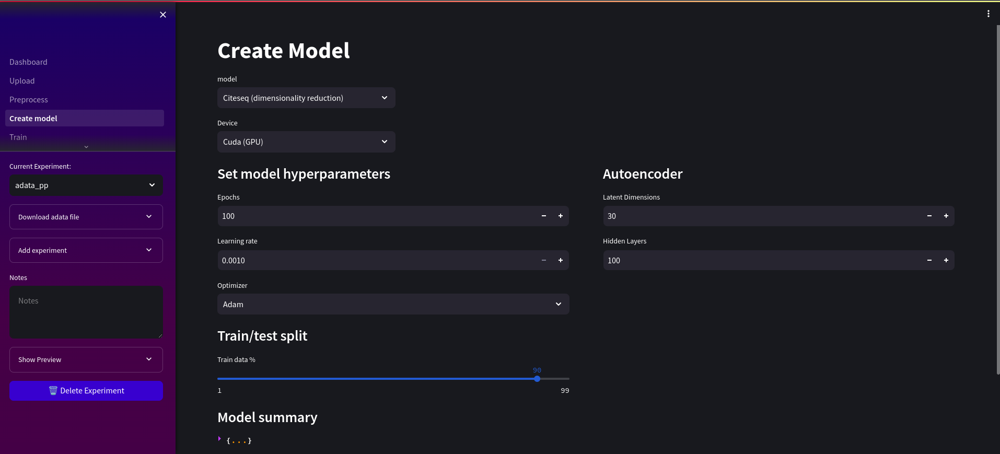
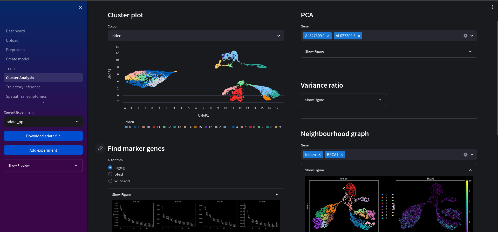
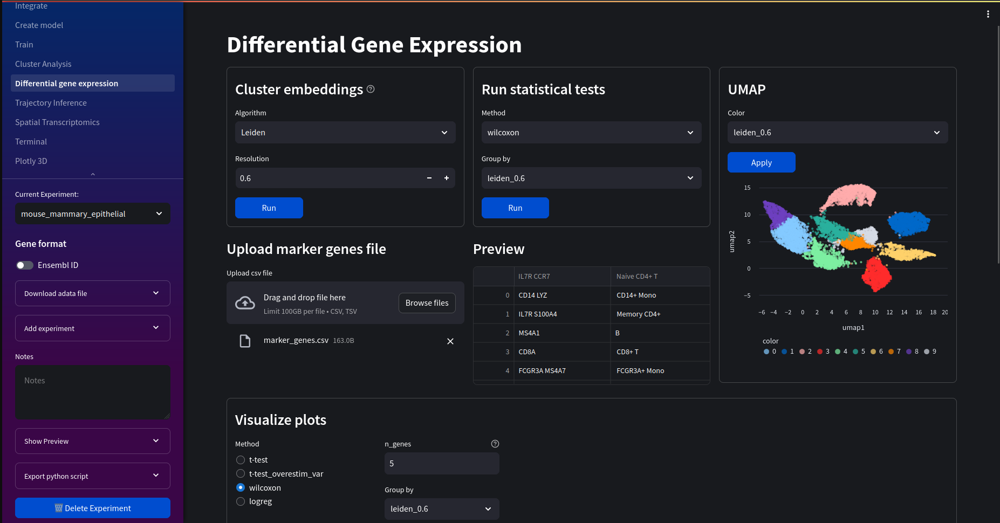
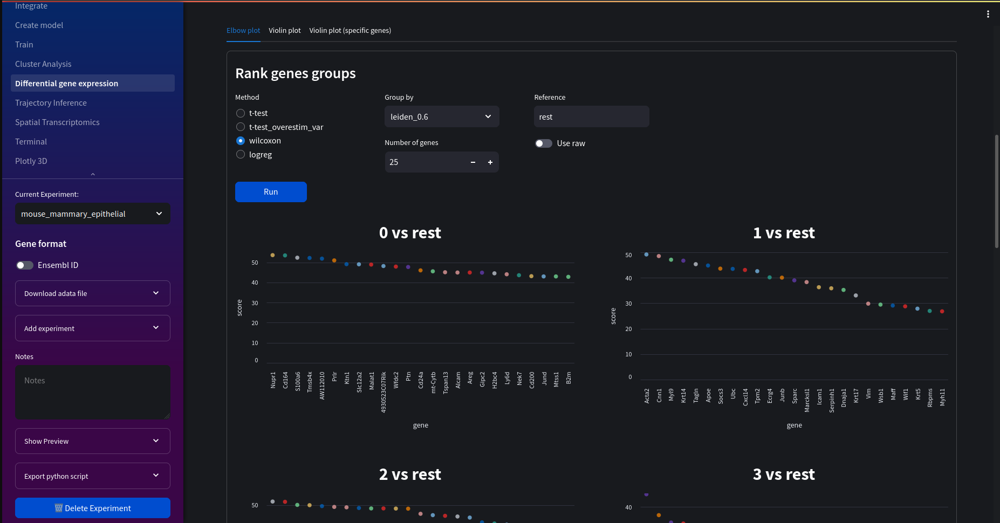
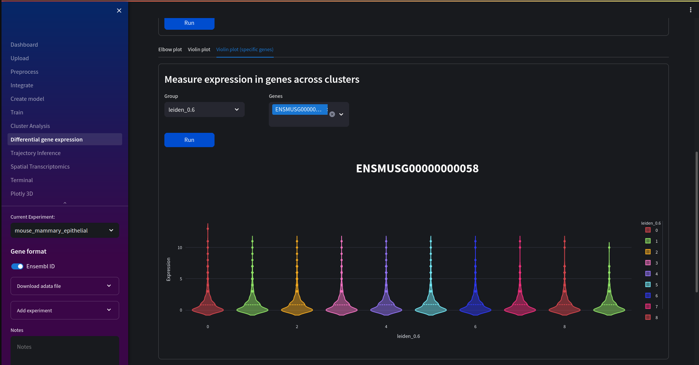
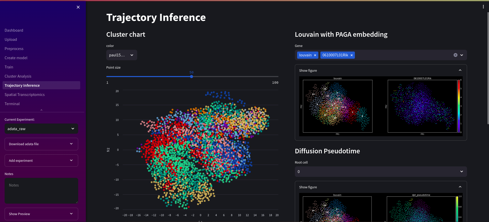

[](https://discord.gg/wBDavdWp8n)

<div style='display: flex;' align="center">
    </img>
</div>

A bioinformatics web tool built with scanpy for genomics data processing and analysis 🧬🐍. 

### \*\*Work in progress! ⚠️\*\*

Deep neural networks have many potential use cases for genomic analyses including quality control, dimensionality reduction or even spatial transcriptomics. Nuwa aims to integrate several deep learning models in a visual, easy to use interface with other filtering and data analysis familiar to most scanpy users. 

## Getting Started

Make sure **docker** and **docker-compose** are installed on your host machine.

Next, clone the repo:
```bash
git clone https://github.com/ch1ru/Nuwa.git && cd Nuwa
```

### If you have a Nvidia GPU:

1.Make sure cuda drivers are installed on the host machine.

2.Install and configure [Nvidia container toolkit](https://docs.nvidia.com/datacenter/cloud-native/container-toolkit/latest/install-guide.html) for docker

3.Bring up container using CUDA dockerfile: 
```bash
docker-compose -f cuda.docker-compose.yml up -d --build
```

### If using a CPU:

Bring up containers using CPU dockerfile:
```bash
docker-compose -f cpu.docker-compose.yml up -d --build
```

Then visit http://localhost in your browser.

## Docs

See our [**Documentation**](https://ch1ru.github.io/Nuwa/) for more information and tutorials.

## Common issues

- Ensure system clock is correct if you encounter release file invalid error when building images:
```error
E: Release file for http://archive.ubuntu.com/ubuntu/dists/focal-updates/InRelease is not valid yet (invalid for another 1min 55s). Updates for this repository will not be applied.
```

## Preprocess

Preprocess 10x genomics reads using scanpy's preprocessing module:
- Filter genes and cell metrics 
- Annotate and filter mitochrondrial, ribosomal and heamoglobin genes 
- Show highly variable genes
- Show most expressed genes
- Normalize, logarithmize and scale data
- Doublet detection
- Batch effect correction
- Cell cycle scoring
- Apply recipes to quickly preprocess data




## Dataset integration

Integrate a variety of dataset types using Scanpy's external integration libraries and SCVI toolkit, along with useful pandas data manipulation for dataframes.



You can also train a deep learning model to integrate datasets using SCVI and scANVI.




## Build model

Available models:
- [Cite-seq](https://github.com/naity/citeseq_autoencoder) dimensionality reduction for cluster analysis. 
- [Solo](https://github.com/calico/Solo) Remove doublets using semi-supervised autoencoders
- [DeepST](https://github.com/JiangBioLab/DeepST) Identify spatial domains using a combination of graph convolutional networks, autoencoders and domain adversarial networks (DANs)

Automatically selects a Cuda capable GPU for faster training if one is available.



## Cluster Analysis

Cluster analysis consists of:
- Autoencoder cluster plot
- Principal Component Analysis of selected genes
- Variance ratio of principal components
- Neighbourhood graph
- Locate marker genes



## Differential gene expression

Differential gene expression looks at how genes are expressed compared to the rest of the dataset. This includes useful matrix plots, dot plots and violin vlots to visualise this. You can also choose which clusters and statistical tests to run the DE analysis.



Elbow plots for comparing clusters:



Interactive violin plots for individual genes or clusters:



## Trajectory Inference

Trajectory inference gives key insights into cell differentiation through ordering the stages of development into a continuous sequence of clusters. Here you can:

- View PAGA graphs
- Embed PAGA into louvain graphs
- View diffusion pseudotime of selected genes



## Spatial Transcriptomics

View expression profiles while retaining spatial information. Currently includes:
- Visualise spatial plots overlaid on histology images
- Neighbourhood enrichment
- Interaction matrices 
- Centrality score
- Ripley score 
- Co-occurance score
- Ligand-receptor interaction


## Plotly 3D

A 3D interactive chart for visualising cluster embeddings.


## Access bioconda evironment

You can access the docker container by running:

```bash
docker exec -it streamlit bash
cd ../streamlit-volume/
#activate bioconda environment
source activate bioconda_env
#interactive python
python3
#also interactive R
R
```

From here you can access many of the python and R packages availble within bioconda. 

## File structure

The streamlit volume is mounted within the installation path of the git repository.

```python
├── Nuwa
    ├── streamlit-volume
        ├── workspace_6f2b160d4a89bafe
            ├── adata
            |   ├── example.h5ad
            ├── downloads
            |   ├──example
            |      ├── seurat #files downloaded in seurat format
            |      |   ├── barcodes.tsv
            |      |   ├── features.tsv
            |      |   ├── matrix.mtx
            |      |   ├── metadata.csv
            |      ├── example.h5ad #files downloaded in h5ad format
            ├── uploads
                ├── example.h5ad
```
  
## Run on mobile

For security reasons the web server is only accessible over a local interface. To disable this run:
```
SERVER_ADDR=0.0.0.0 docker-compose up --build
```
The app can then be accessed on http://IP_ADDRESS_OF_COMPUTER in your phone's browser.

**⚠️ THIS WILL ALLOW ANYONE IN YOUR LOCAL NETWORK TO ACCESS THE WEB SERVER AND HENCE YOUR COMPUTER'S RESOUCES AND DOCKER ENVIRONMENT**

The host's filesysystem will not be accessible to others.

## Running Tests

Automated unit tests can be run using the tests docker compose file:

```
docker-compose -f tests.docker-compose.yml up --build
```

## Future work

- Add other models
- Transfer learning, saving and loading models
- support other file types
- Add other analysis scores/graphs

## Contributing

If you have a feature request, notice a bug or have issues running the app please let us know in the [Issues](https://github.com/ch1ru/Nuwa/issues) or [Discussions](https://github.com/ch1ru/Nuwa/discussions) tabs! Want to make a contribution? Make a pull request!

## Citations

*[1] Lin, X., Tian, T., Wei, Z. et al. Clustering of single-cell multi-omics data with a multimodal deep learning method. Nat Commun 13, 7705 (2022). https://doi.org/10.1038/s41467-022-35031-9.*

*[2] Bernstein, N., Fong, N., Lam, I. et al. (2020). Solo: Doublet Identification in Single-Cell RNA-Seq via Semi-Supervised Deep Learning. https://www.cell.com/cell-systems/fulltext/S2405-4712(20)30195-2.*

*[3] Jiang, Q., Xu, C., Jin, X. et al. (2022). DeepST: identifying spatial domains in spatial transcriptomics by deep learning. https://academic.oup.com/nar/article/50/22/e131/6761985.*

## Donate ₿❤️

All development is non-profit, any contributions are greatly appreciated! Donate in bitcoin to:

<div style='display: flex;'>


</div>

Bitcoin address (on-chain)
```
bc1qs9l5dvkrtgcxfewm5ly6rs47p2qjxv55qkqwwu
```


