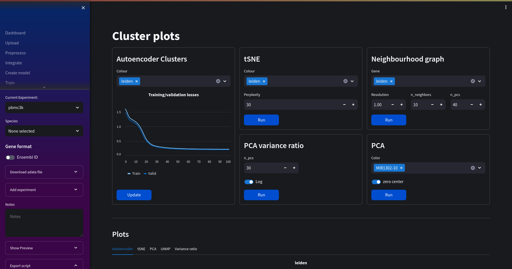

# Nuwa 🧬🐍
A bioinformatics web tool built with scanpy for genomics data processing and analysis. 

### \*\*Work in progress! ⚠️\*\*

Deep neural networks have many potential use cases for genomic analyses including quality control, dimensionality reduction or even spatial transcriptomics. Nuwa aims to integrate several deep learning models in a visual, easy to use interface with other filtering and data analysis familiar to most scanpy users. 

## Getting Started

First, clone the repo:
```bash
git clone https://github.com/ch1ru/Nuwa.git && cd Nuwa
```

The easiest way to get started is using docker compose:
```bash
docker-compose up --build
```
You can also use [docker desktop](https://www.docker.com/products/docker-desktop/)

Then visit http://localhost in your browser.

## Preprocess

Filter genes and cell metrics, find mitochrondrial and ribosomal genes, look at variability in gene expression.


## Build model

Available models:
- [Cite-seq](https://github.com/naity/citeseq_autoencoder) dimensionality reduction for cluster analysis. 
- [Solo](https://github.com/calico/Solo) Remove doublets using semi-supervised autoencoders
- [DeepST](https://github.com/JiangBioLab/DeepST) Identify spatial domains using a combination of graph convolutional networks, autoencoders and domain adversarial networks (DANs)

Automatically selects a Cuda capable GPU for faster training if one is available.


## Cluster Analysis

Currently analysis consists of:
- Autoencoder cluster plot
- Principal Component Analysis of selected genes
- Variance ratio of principal components
- Neighbourhood graph



## Trajectory Inference

View PAGA graphs and embed PAGA into louvain graphs, view diffusion pseudotime of selected genes.


## Spatial Transcriptomics

View expression profiles while retaining spatial information. Currently includes:
- Visualise spatial plots overlaid on histology images
- Neighbourhood enrichment
- Interaction matrices 
- Centrality score
- Ripley score 
- Co-occurance score
- Ligand-receptor interaction


## Future work

- Integrate postgresql database for persistent record keeping
- Add logging, make visible on ui
- Add other autoencoder models
- support other files types
- Add other analysis scores/graphs