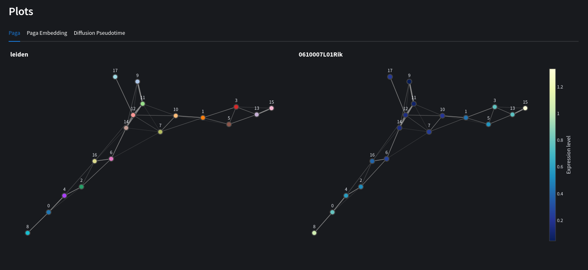

# Nuwa 🧬🐍
A bioinformatics web tool built with scanpy for genomics data processing and analysis. 

### \*\*Work in progress! ⚠️\*\*

Deep neural networks have many potential use cases for genomic analyses including quality control, dimensionality reduction or even spatial transcriptomics. Nuwa aims to integrate several deep learning models in a visual, easy to use interface with other filtering and data analysis familiar to most scanpy users. 

## Getting Started

First, clone the repo:
```bash
git clone https://github.com/ch1ru/Nuwa.git && cd Nuwa
```

Get started using docker compose:
```bash
docker-compose up -d --build
```
You can also use [docker desktop](https://www.docker.com/products/docker-desktop/)

Then visit http://localhost in your browser.

## Preprocess

Preprocess 10x genomics reads using scanpy's preprocessing module:
- Filter genes and cell metrics 
- Annotate and filter mitochrondrial and ribosomal genes 
- Show highly variable genes
- Show most expressed genes
- Normalize and logarithmize data
- Apply recipes to quickly preprocess data


## Build model

Available models:
- [Cite-seq](https://github.com/naity/citeseq_autoencoder) dimensionality reduction for cluster analysis. 
- [Solo](https://github.com/calico/Solo) Remove doublets using semi-supervised autoencoders
- [DeepST](https://github.com/JiangBioLab/DeepST) Identify spatial domains using a combination of graph convolutional networks, autoencoders and domain adversarial networks (DANs)

Automatically selects a Cuda capable GPU for faster training if one is available.


## Cluster Analysis

Cluster analysis consists of:
- Autoencoder cluster plot
- Principal Component Analysis of selected genes
- Variance ratio of principal components
- Neighbourhood graph
- Locate marker genes


## Trajectory Inference

Trajectory inference gives key insights into cell differentiation through ordering the stages of development into a continuous sequence of clusters. Here you can:

- View PAGA graphs
- Embed PAGA into louvain graphs
- View diffusion pseudotime of selected genes



## Spatial Transcriptomics

View expression profiles while retaining spatial information. Currently includes:
- Visualise spatial plots overlaid on histology images
- Neighbourhood enrichment
- Interaction matrices 
- Centrality score
- Ripley score 
- Co-occurance score
- Ligand-receptor interaction


## Future work

- Improve error logging
- Add other models
- Transfer learning, saving and loading models
- support other 10x file types
- Add other analysis scores/graphs
- Unit testing

## Citations

*[1] Lin, X., Tian, T., Wei, Z. et al. Clustering of single-cell multi-omics data with a multimodal deep learning method. Nat Commun 13, 7705 (2022). https://doi.org/10.1038/s41467-022-35031-9.*

*[2] Bernstein, N., Fong, N., Lam, I. et al. (2020). Solo: Doublet Identification in Single-Cell RNA-Seq via Semi-Supervised Deep Learning. https://www.cell.com/cell-systems/fulltext/S2405-4712(20)30195-2.*

*[3] Jiang, Q., Xu, C., Jin, X. et al. (2022). DeepST: identifying spatial domains in spatial transcriptomics by deep learning. https://academic.oup.com/nar/article/50/22/e131/6761985.*