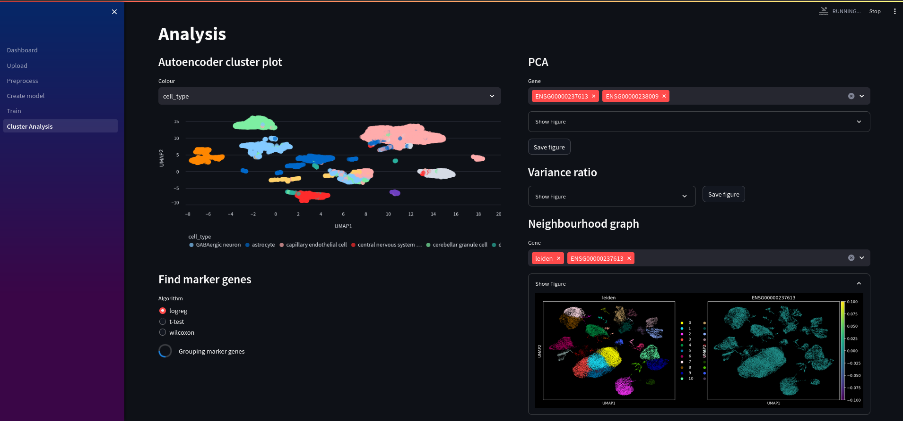

# Nuwa 🧬🐍
A Bioinformatics tool for data processing and analysis

### **Work in progress**

## Getting Started

First, clone the repo:
```bash
git clone https://github.com/ch1ru/Nuwa.git && cd Nuwa
```

The easiest way to get started is using docker compose:
```bash
docker-compose up -d --build
```

Alternatively, you can run streamlit directly:
```bash
cd streamlit && streamlit run Dashboard.py --server.maxUploadSize 100000
```

Then visit http://localhost in your browser.

## Preprocess


## Build model


## Analysis


